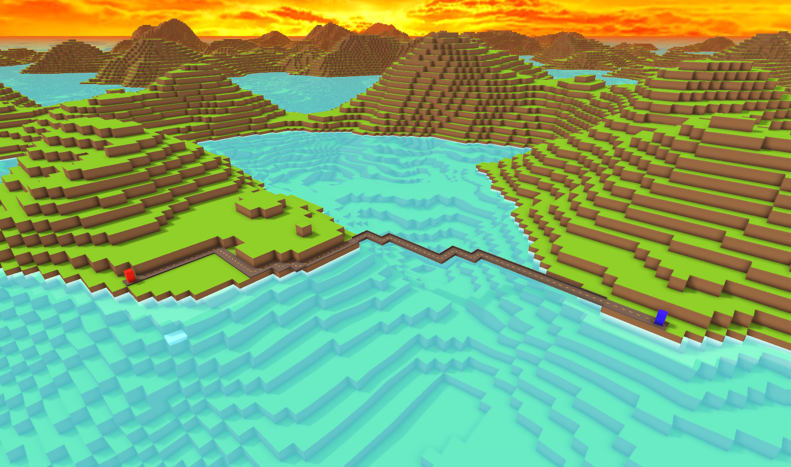
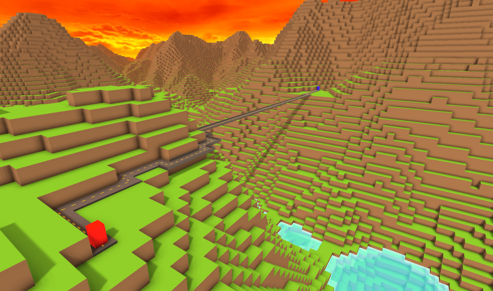
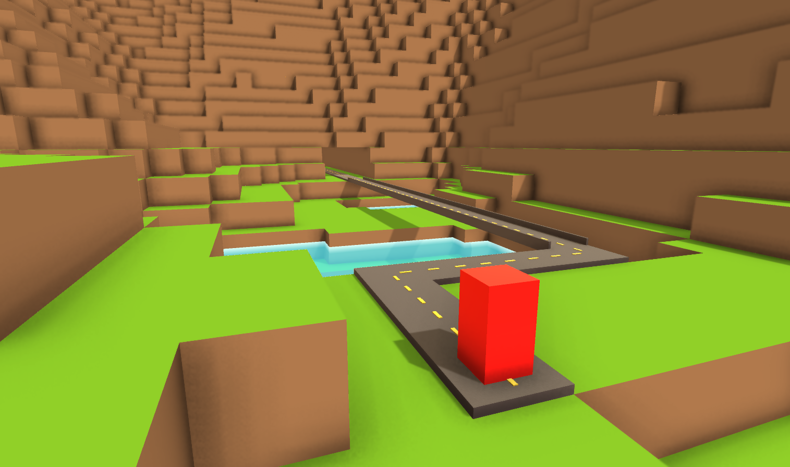
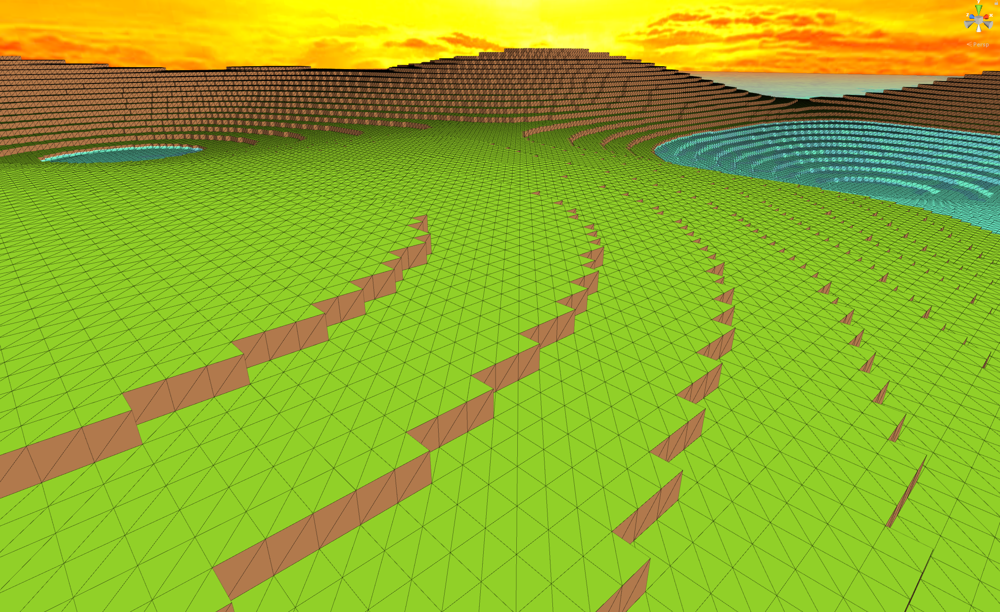
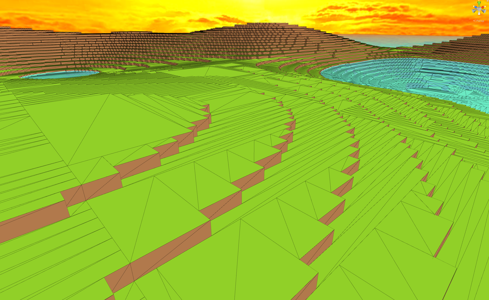

# Procedural World and A* Road Generator

This is a procedurally generated world composed of voxels. Two points can be selected in the world as start and end points to a road. Using an A* path finding algorithm the shortest path between the two points will be calculated and a road will be generated. The size and type of terrain can be modified at run-time.

A video providing an overview of the project can be found [here](https://youtu.be/UZvhlSldBZ8).

## Getting Started

Download the project and Unity3D. Navigate to `Voxel World and A-star Road Generator > Assets > Scenes` and open one of the scenes to launch Unity3D.

### Prerequisites

Unity3D is needed to modify and recompile the project. Unity can be downloaded [here](https://unity3d.com/get-unity/download). Select the Visual Studio Community download in the Unity3D installer to be able to make changes to the code and debug the project.

### Instructions

In reference to the UI, the type of terrain can be selected from under the `Terrain Type`
dropdown menu. The world size in chunks can be selected as well as the option to render using
the greedy meshing algorithms discussed in the report. The `Generate World` button will begin
the generation of the world. Depending on the world size and greedy meshing setting, world
generation may take up to a minute.

Once the world is generated, a start and end location for the road to be generated can be set by
following the instructions in the textbox on the bottom right of the screen. The cost sliders can
be used to adjust the behaviour of the A* algorithm. Note that depending on the distance
between the start and end location, as well as the costs of ramps/bridges/tunnels, the algorithm
may take a very long time to compute the path. To be able to build bridges and tunnels without
a long computation time, set their values to around 10-30 and make the road relatively short.

## Deployment

The project can be built for either `Windows` or `MacOS`

To do so:

1. Load `Scene 1`
2. Select `File > Build Settings...` from the top menu in Unity
3. Make sure `scene 1` is selected in the `Scenes In Build` box, if it is not then add the desired scene
4. Select the `PC, Mac & Linux Standalone` platform
5. Choose the desired Target Platform from the dropdown menu, either `Windows` or `MacOS`
6. Select `Build` or `Build And Run` to compile an executable

## Built With

* [Unity3D](https://unity3d.com/) - The graphics engine used
* [Visual Studio Community 2017](https://visualstudio.microsoft.com/vs/community/) - The IDE used
* [SSAO Pro](https://assetstore.unity.com/packages/vfx/shaders/fullscreen-camera-effects/ssao-pro-22369) by Thomas Hourdel
* [Shader Forge](http://www.acegikmo.com/shaderforge/) by Joachim Holmer
* [Violent Days Skybox](https://forums.epicgames.com/unreal-tournament-2003-2004/ut2004-level-editingmodeling-skinning/108243-my-skies-and-and-cliff-textures-large-images) by Hipshot

## Compatibility

Tested with Unity 2018.2.13f1 and Visual Studio Community 2017 Version 15.8.7

## Images

## Authors

* **Tyler Loewen** - [GitHub](https://github.com/TylerLoewen)
* **Matthew Kania** - [Blog](https://rimplydev.com/), [Twitter](https://twitter.com/rimplydev), [GitHub](https://github.com/MattKania)

## License

This project is licensed under the GNU General Public License - see the [GNU General Public License v3](GNU\sGeneral\sPublic\sLicense\sv3.txt) file for details

## References

[Oliveira, Caue Viegas, et al. "Game Engine with 3D Graphics." 2016.](https://pdfs.semanticscholar.org/f269/4330ed2ef9bf2f3db2a3099b6ac8ef222d66.pdf)

[E. Galin, et al. "Procedural Generation of Roads." 2010.](https://www.researchgate.net/profile/Eric_Guerin2/publication/229707505_Procedural_Generation_of_Roads/links/59b2405c458515a5b48ab3f1/Procedural-Generation-of-Roads.pdf)

[Mikola Lysenko "Meshing in a Minecraft Game." 2012.](https://0fps.net/2012/06/30/meshing-in-a-minecraft-game)

[Sebastian Lague “A* Pathfinding.” 2014.](https://www.youtube.com/watch?v=-L-WgKMFuhE)
